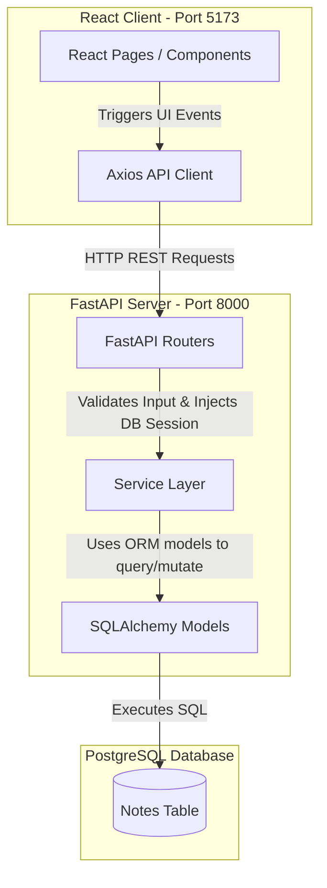

# Project Analysis: Notes Manager

A comprehensive analysis of the **Notes Manager** codebase, detailing the architectural design, codebase layout, data flows, database schema, and an evaluation of implementation choices.

---

## 1. System Architecture & Technologies

The project is structured as a classic decoupled Client-Server architecture:



### Core Technologies
*   **Backend**: 
    *   **FastAPI**: Modern, fast (high-performance) web framework for building APIs with Python 3.8+ based on standard Python type hints.
    *   **SQLAlchemy**: Database ORM (Object Relational Mapper) mapping Python classes to database tables.
    *   **Alembic**: Database migrations tool for SQLAlchemy.
    *   **Pydantic**: Data validation and settings management using Python type annotations.
*   **Frontend**:
    *   **React**: A JavaScript library for building user interfaces.
    *   **Vite**: Frontend toolchain / build tool for fast hot module replacement (HMR).
    *   **Tailwind CSS (v4)**: Utility-first CSS framework (configured via the new Vite plugin syntax).
    *   **React Router (v7)**: Declarative routing library for React.
    *   **Axios**: Promise-based HTTP client for the browser.

---

## 2. Directory Layout & Codebase Structure

The project root contains two main sub-directories: `backend/` and `frontend/`.

```
notes-manager/
├── README.md               # Root documentation
├── backend/                # FastAPI Application
│   ├── alembic/            # Alembic Migrations
│   │   └── versions/       # Individual migration files
│   ├── alembic.ini         # Alembic Config
│   ├── app/                # Main Python application package
│   │   ├── db/             # DB session management & lifecycle
│   │   ├── models/         # SQLAlchemy DB models (schema mapping)
│   │   ├── routers/        # FastAPI endpoints handlers
│   │   ├── schemas/        # Pydantic schemas (data transfer objects)
│   │   ├── services/       # Core business logic / DB transactions
│   │   └── main.py         # App Entry Point & Middleware
│   ├── requirements.txt    # Python dependencies list
│   └── .env                # Local environment secrets/configuration
└── frontend/               # React Application
    ├── public/             # Static public assets
    ├── src/                # React source code
    │   ├── api/            # API wrappers (Axios client config)
    │   ├── components/     # Reusable UI components
    │   ├── pages/          # Router pages/view components
    │   ├── App.jsx         # Routes definitions
    │   ├── index.css       # Tailwind entry point CSS file
    │   └── main.jsx        # React DOM render entry point
    ├── eslint.config.js    # ESLint configuration
    ├── package.json        # Node dependency manifest
    └── vite.config.js      # Vite build configuration
```

---

## 3. Database Schema

The application uses a single PostgreSQL table managed via Alembic:

### `notes` Table Schema

| Column Name  | PostgreSQL Type | Attributes | Description |
| :--- | :--- | :--- | :--- |
| **`id`** | `INTEGER` | Primary Key, Indexed, Serial | Auto-incrementing identifier for the note |
| **`title`** | `VARCHAR(255)` | `NOT NULL` | The title of the note |
| **`content`** | `TEXT` | `NOT NULL` | The body content of the note |
| **`created_at`** | `TIMESTAMP WITH TIME ZONE` | Default: `now()` | Time the note was created |
| **`updated_at`** | `TIMESTAMP WITH TIME ZONE` | Default: `now()`, updates on modification | Time the note was last updated |

---

## 4. REST API Endpoints

The API is fully documented automatically via Swagger at `/docs`. Below is the summary of the endpoints implemented in [note.py](file:///Users/suryasahil/Documents/Projects/notes-manager/backend/app/routers/note.py):

| Method | Path | Request Body | Response Shape | Status Code | Description |
| :--- | :--- | :--- | :--- | :--- | :--- |
| **POST** | `/notes/` | `NoteCreate` | `NoteResponse` | `201 Created` | Creates a new note |
| **GET** | `/notes/` | None | `list[NoteResponse]` | `200 OK` | Retrieves all notes ordered by newest |
| **GET** | `/notes/{note_id}` | None | `NoteResponse` | `200 OK` | Retrieves a single note by ID (or returns 404) |
| **PUT** | `/notes/{note_id}` | `NoteUpdate` | `NoteResponse` | `200 OK` | Partially updates a note by ID (or returns 404) |
| **DELETE** | `/notes/{note_id}` | None | `{"message": "..."}` | `200 OK` | Deletes a note by ID (or returns 404) |

---

## 5. Architectural Evaluation & Observations

### Strengths
1. **Clean Separation of Concerns**: 
   * The backend decouples HTTP handling (`routers`) from database operations (`services`). This keeps the handler layer thin, making services easily unit-testable.
   * Explicit imports at the package level (`__init__.py` files) make routing files clean and minimize nested import paths.
2. **Robust Validation**:
   * Uses Pydantic (`schemas`) to validate payload constraints (e.g. `min_length=1`, `max_length=255`) directly at the server boundary before executing database queries.
3. **Decoupled API Client Layer**:
   * The frontend isolates Axios requests inside the `api/` directory. View pages do not call standard axios operations, keeping layout/rendering logic clean.

### Opportunities for Improvement
* **Hardcoded CORS Origins**: 
  In [main.py](file:///Users/suryasahil/Documents/Projects/notes-manager/backend/app/main.py), the `CORSMiddleware` `allow_origins` array contains a hardcoded Vercel deployment link (`https://notes-manager-eight-topaz.vercel.app`). In production, this should ideally be loaded from environment variables (`.env`) for flexibility across staging, testing, and production servers.
* **Pagination**:
  The `GET /notes/` endpoint returns *all* notes in the database. As the database grows, querying and returning all records in a single request could cause memory and performance bottlenecks. Implementing pagination (e.g. `limit` and `offset` query params) would be a good design improvement.
* **Global Error Handling**:
  The React frontend catches API errors on a page-by-page basis. While this works fine for a simple app, implementing an Axios interceptor or a React Error Boundary would provide a more consistent global user experience in case of generic network failures.
